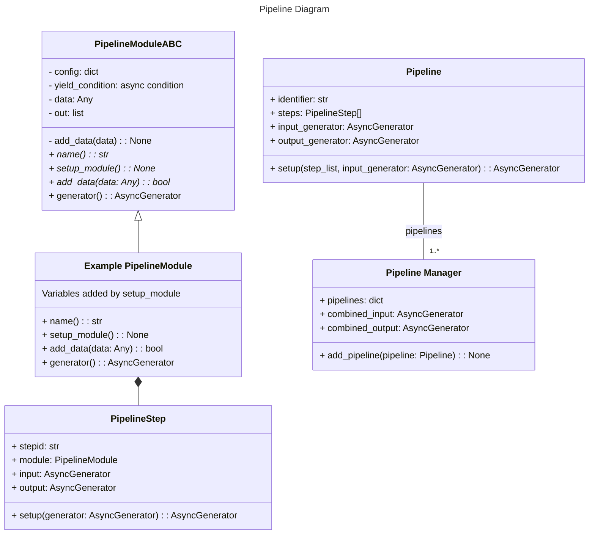

```mermaid
---
title: Pipeline Diagram
---
classDiagram
  class mabc["PipelineModuleABC"] {
    - config: dict
    - yield_condition: async condition
    - data: Any
    - out: list
    - add_data(data): None
    + name()*: str
    + setup_module()*: None
    + add_data(data: Any)*: bool
    + generator(): AsyncGenerator
  } 
  class m["Example PipelineModule"] {
    Variables added by setup_module
    + name(): str
    + setup_module(): None
    + add_data(data: Any): bool
    + generator(): AsyncGenerator
  }
  mabc <|-- m
  class s["PipelineStep"] {
    + stepid: str
    + module: PipelineModule
    + input: AsyncGenerator
    + output: AsyncGenerator
    + setup(generator: AsyncGenerator): AsyncGenerator
  }
  m *-- s
  class p["Pipeline"] {
    + identifier: str
    + steps: PipelineStep[]
    + input_generator: AsyncGenerator
    + output_generator: AsyncGenerator
    + setup(step_list, input_generator: AsyncGenerator): AsyncGenerator
  }
  class pm["Pipeline Manager"] {
    + pipelines: dict
    + combined_input: AsyncGenerator
    + combined_output: AsyncGenerator
    + add_pipeline(pipeline: Pipeline): None
  }
  p --"1..*" pm: pipelines

```